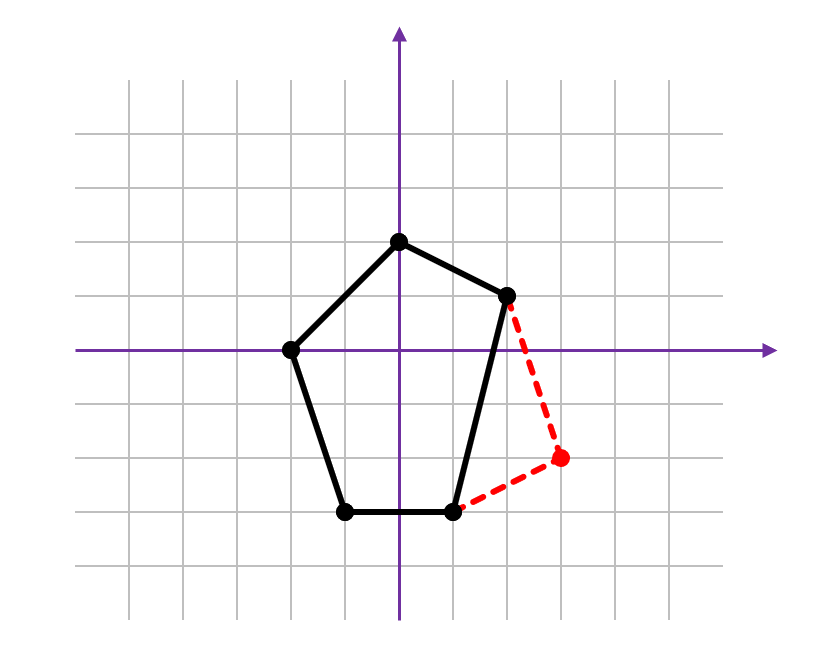

# C. 凸包扩展

| | |
|---|---|
| 时间限制 | 4 秒 |
| 内存限制 | 1024 MB |

## 题目

Hugh Klidd 博士是一位几何学专家，最近迷上了凸包问题。回忆一下，对于 x-y 平面上的一组点，凸包是包含所有这些点的最小凸多边形。（凸多边形的性质是，对于多边形上或内部的任意两点，连接这两点的线段完全位于多边形上或内部。）Klidd 博士刚刚计算了一组点 S 的凸包，记为 H(S)，并对结果非常满意：

- 凸包有 n ≥ 3 个顶点
- 每个顶点的坐标均为整数
- 凸包的任意三个顶点不共线

然而，Klidd 博士很有野心，他希望凸包能够扩展。具体来说，他正在寻找一个**扩展点**，即满足以下条件的点 p = (x, y)：

1. x 和 y 为整数
2. 若 S' = S ∪ {p}（将 p 加入 S），则 S' 的凸包 H(S') 有 n + 1 个顶点
3. 这 n + 1 个顶点中没有三个共线

换句话说，扩展点使凸包顶点数增加 1，同时保持其所有优良性质。对于大多数凸包 H(S)，Klidd 博士通常至少能找到一个扩展点，但他想知道**有多少**个扩展点可供选择。他推测存在一种高效的方法来计算扩展点的数量，但由于从未学过算法课程，他向你求助。



## 输入

- 第一行包含一个整数 **n**（3 ≤ n ≤ 50），表示凸包的顶点数。
- 接下来 **n** 行，每行包含两个空格分隔的整数 — 一个顶点的 *x* 和 *y* 坐标（−1000 ≤ *x*, *y* ≤ 1000）。
- 这 *n* 个点互不相同，没有三点共线，且按**逆时针顺序**给出。

## 输出

如果扩展点的数量是无限的，输出 `infinitely many`。否则，输出扩展点的数量。

## 样例

### 样例 1

**输入：**
```
5
0 2
-2 0
-1 -3
1 -3
2 1
```

**输出：**
```
23
```

### 样例 2

**输入：**
```
4
-7 -7
7 -7
7 7
-7 7
```

**输出：**
```
infinitely many
```

**解释：** 凸包是一个正方形。沿任一条边向外延伸线上的任意整数点都是扩展点——而每条边的延长线上有无限多个这样的点。

## 注释

Klidd 博士之前恰好做过四个推测，所以这是他的第五公设。


### AI 解析

题目概述：给定一个有 n 个顶点的凸包（整数坐标，逆时针顺序），计算整数点 p 的数量，使得将 p 加入点集后凸包恰好有 n + 1 个顶点且没有三个顶点共线。若数量无限，输出 "infinitely many"。

关键观察：

1. 扩展点可以在哪里？它必须严格位于当前凸包外部，但位于由两条相邻边向外延伸所形成的"扩展楔形"内。具体来说，对于每条边 (vi, vi+1)，使得 vi+1 不再是凸包顶点（被 p 替代）的扩展点必须位于由 (vi−1, vi) 和 (vi+1, vi+2) 的延长线向外所围成的区域——实际上是在"倒角"一个顶点。

更精确地说：p 必须位于凸包外部，严格在某一条边的外侧，而在所有其他边的内侧（或边上）。这意味着 p 必须位于某条特定边的外部但仍从凸包"可见"的区域。

2. 何时数量无限？当某条边的外部区域无限延伸——即相邻两条边的延长线平行（或外部楔形无界）。当连续边具有相同的斜率方向时会发生这种情况。样例 2（正方形）：每对对边平行，因此向外延伸任一条边会得到无限的整数点半带。

3. 当有限时，计算每条边外部有界区域中的格点数。对于 n ≤ 50 且坐标 ≤ 1000，每个区域足够小，可以直接枚举或通过 Pick 定理计算。

4. 算法概要：对于每条边，计算外部可行区域（其他边的半平面交 + 该边的外部）。检查是否有界。若有界，通过枚举或基于面积的方法计算整数点数。若任何边的区域无界，答案为 "infinitely many"。
